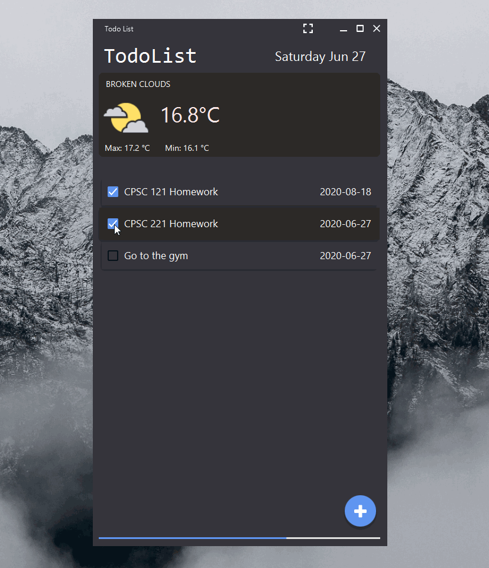

# TodoList

TodoList application made using Java 8.
JavaFX was used to create the GUI.

## Features
* Automatic load/save using JSON to store data
* Use an API to get the weather for the current day
* GUI inspired by material design, focusing on responsive animations and transitions, padding, and depth effects.

## Installation

To run the program, clone/download the project and execute the following command:
```bash
java -jar todolist.jar
```

## Demo Gif

  


